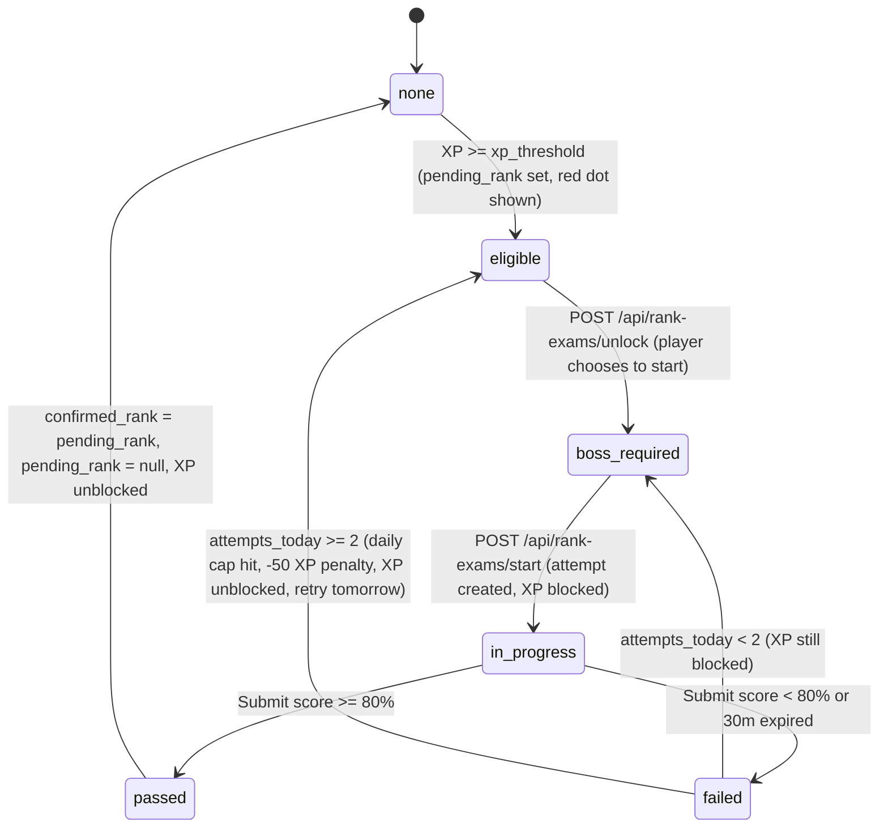

# Schema Semantics

This file explains the business meaning of important state-like fields.

## Ownership Chain (Phase 10)

All campaign-scoped resources are secured through the following chain:

```
Account (JWT sub) → Player (account_id FK) → Campaign (player.active_campaign_id) → Resource
```

**Resources scoped to campaign** (filter by `campaign_id`):
- `quests`, `weekly_missions`, `boss_battles`, `check_ins`
- `campaign_skill_states`, `badge_unlocks`
- `rank_exam_attempts`, `rank_exam_answers`
- `skill_rank_suggestions`, `weakness_suggestions`
- `certificate_records` (also filtered by `player_id`)
- `writing_entries`, `speaking_entries`, `mock_tests`, `test_records`, `error_logs`
- `roadmap_phases`, `study_plan_weeks`, `study_plan_sessions`

**Resources scoped to player** (filter by `player_id`):
- `vocabulary_items`, `vocabulary_examples`, `vocabulary_collocations`, `vocabulary_relations`
- `vocabulary_topics`, `vocabulary_nodes`, `vocabulary_edges`
- `flashcards`, `spaced_repetition_states`
- `vocabulary_errors`

**HTTP error conventions:**
- `401 Unauthorized` — missing or invalid JWT token
- `403 Forbidden` — account exists but is inactive
- `404 Not Found` — resource exists but does not belong to the authenticated account (prevents existence disclosure)

**Exempt routes (no auth required):**
- `GET /api/health`
- `POST /api/auth/register`, `POST /api/auth/login`, `POST /api/auth/refresh`
- `GET /api/quest-templates`, `GET /api/materials`, `GET /api/materials/{id}` (public reference data)
- `POST /api/dev/reset`, `POST /api/dev/run_migrations`, `POST /api/dev/regenerate-quests` (dev-only)

**Campaign-optional route:**
- `POST /api/certificates/manual` — player must exist (auth required) but campaign may not yet exist (pre-onboarding certificate submission). Uses `get_optional_campaign` dependency.

## Rank and Promotion

Used by `campaign_skill_states` (representing campaign-scoped skill rank).

Allowed ladder:

- `F`
- `E`
- `D`
- `C`
- `B`
- `A`
- `S`

Meaning:

- lower ranks represent earlier progression.
- higher ranks represent stronger demonstrated progress.
- `confirmed_rank`: The current verified rank of the skill.
- `pending_rank`: The next target rank once the XP threshold is met, waiting for exam confirmation.
- `promotion_status`: The gatekeeper status for rank-up progression:
  - `none`: Normal state, skill is accumulating XP freely.
  - `eligible`: XP threshold met. UI shows a red dot notification on the skill tag. The player can choose when to attempt the exam — XP continues normally.
  - `boss_required`: Player has explicitly unlocked the exam (`POST /api/rank-exams/unlock`). **Skill XP is now blocked** — quest claim for this skill will not award XP until the player passes the exam.
  - `in_progress`: An active exam attempt exists. XP remains blocked.
  - `passed`: Score >= 80%. `confirmed_rank` is updated, XP block is lifted, status resets to `none`.
  - `failed`: Score < 80% or time expired (30m).

### Rank Promotion State Machine



- **Transitions Detail**:
  - `none → eligible`: `recompute_skill_progress` detects `calc_idx > conf_idx` (XP rank exceeds confirmed rank). Sets `pending_rank` and `promotion_status = eligible`. XP accrual continues freely.
  - `eligible → boss_required`: `POST /api/rank-exams/unlock` — player explicitly chooses to start the promotion process. From this point **skill XP is blocked**: quest claim for this skill returns 0 XP (quest still completable, XP held at 0 for that skill).
  - `boss_required → in_progress`: `POST /api/rank-exams/start` — creates a `rank_exam_attempts` record with `status = in_progress` and `expires_at = now + 30m`.
  - `in_progress → passed`: `POST /api/rank-exams/{attempt_id}/submit` graded >= 80%. Updates `confirmed_rank = pending_rank`, logs `skill_rank_history`, clears `pending_rank`, sets `promotion_status = none`. XP block lifted.
  - `in_progress → failed`: Graded < 80% or `submitted_at > expires_at`. Attempt `status = failed`.
  - `failed → boss_required`: If `COUNT(attempts today for this skill/rank transition) < 2` — reset to `boss_required`. XP still blocked.
  - `failed → eligible`: If `COUNT(attempts today) >= 2` (daily cap hit) — subtract 50 directly from `campaign_skill_states.xp` (floor at 0), reset to `eligible`. XP block lifted. Player retries tomorrow.

### Retry Limit Counting Rule

Max **2 attempts per day** per skill rank transition, scoped to `(campaign_id, skill_id, from_rank)`.

Query pattern to count today's attempts:

```sql
SELECT COUNT(*)
FROM rank_exam_attempts
WHERE campaign_id = :campaign_id
  AND skill_id = :skill_id
  AND from_rank = :from_rank
  AND DATE(started_at) = CURDATE()
```

If `COUNT >= 2`: block `POST /api/rank-exams/start`, return HTTP 429, and transition `promotion_status → eligible`.

### XP Block Rule

When `promotion_status` is `boss_required` or `in_progress`:
- `POST /api/quests/{id}/claim` for a quest whose `skill_id` matches the blocked skill must **not** award skill XP.
- Player XP (global) is also not awarded for that quest's skill portion.
- The quest itself can still be marked completed — only the XP award is suppressed.
- XP block is lifted when `promotion_status` returns to `none` (passed) or `eligible` (daily cap hit — `campaign_skill_states.xp` reduced by 50, floored at 0).

## Quest Role

Used mainly by daily quest templates and instances.

Known values:

- `core`
  - the main high-value daily work
- `support`
  - reinforcement work that supports a main skill
- `mini`
  - short or lightweight maintenance work

## Daily Slot Code

Used only for daily-quest uniqueness protection.

Rules:

- For legacy daily quests, `daily_slot_code` matches the role (`core`, `support`, `mini`).
- For new skill-quota daily quests, `daily_slot_code` represents the specific skill activity type:
  - `vocabulary_flashcard`
  - `vocabulary_codex`
  - `vocabulary_collocation`
  - `reading_scan`
  - `listening_dictation`
  - `grammar_pattern`
  - `collocation_forge`
- non-daily quests can keep `daily_slot_code = null`

## Quest Status

Status values vary by surface, but conceptually represent where the user is in the loop:

- available / active
- completed but reward not yet claimed
- claimed
- failed / expired
- archived

Exact rendering is UI-dependent, but the backend uses this family of meanings.

## Completed vs Reward Claimed

- `completed = true` means the quest action was performed
- `reward_claimed = true` means the XP/reward was actually banked

These are intentionally separate.

## Scope

This project uses three scope types:

- **account-scoped**
  - identity, security, authentication sessions, system preferences
- **campaign-scoped**
  - live progression surfaces, check-ins, suggestions, skill states, badge ownership, settings, quotas, rank exam attempts
- **player-wide**
  - long-term learner profile, learning style preferences, IELTS test history

## Suggestion Source Fields

Physical typed source fields in the database:

- `source_test_record_id`: Links to a mock test or historical test entry.
- `source_certificate_record_id`: Links to a manually entered IELTS score certificate (newly added to both `skill_rank_suggestions` and `skill_rank_history`).
- `source_mock_test_id`: Links to a specific full mock exam attempt.
- `source_error_log_id`: Links to an item from the mistake/error log.
- `source_quest_id`: Links to a completed daily/weekly quest.

Legacy source fields (`source_type` and `source_ref_id`) have been removed from the database schema as physical columns and are now computed dynamically as virtual properties from the typed fields.

## Account Status and Role

Used by `accounts` model.

Allowed `status`:
- `active`
- `pending_verification`
- `disabled`
- `locked`
- `deleted`

Allowed `role`:
- `user`
- `admin`

## Rank Boss Exam Attempt Status

Used by `rank_exam_attempts` model.

Allowed `status`:
- `in_progress`
- `submitted`
- `passed`
- `failed`
- `expired`
- `abandoned`

## Onboarding and Campaign Setup Atomicity

To ensure database consistency and avoid half-onboarded state anomalies:
- `accounts.onboarding_completed` (Account level) and `campaigns.setup_completed` (Campaign level) must be updated **atomically** in the same database transaction.
- When the user finishes the onboarding flow (e.g. via `POST /api/onboarding/activate-campaign`), the backend must commit both status flags to `true` along with the creation of the campaign settings, quotas, and initial daily quests inside a single transaction blocks. If any operation fails, the entire activation sequence must roll back.

## IELTS Score to Rank Mapping

When a user manually submits their official IELTS band scores (via the onboarding flow or manual certificate uploads), the system bypasses the Rank Boss exam requirement. It maps the IELTS bands directly to the suggested game ranks and updates the player's `confirmed_rank` immediately upon application.

The mapping table:

| IELTS Band | Suggested Rank | Minimum XP | Rank Description |
| :--- | :---: | :---: | :--- |
| **0.0 - 3.5** | `F` | 0 | Foundation / Unstable basics |
| **4.0** | `E` | 500 | Very basic control |
| **4.5** | `D` | 1,200 | Simple task handling |
| **5.0 - 5.5** | `C` | 2,500 | Pre-band 6 bridge |
| **6.0** | `B` | 4,500 | Band 6 base |
| **6.5** | `A` | 7,000 | Near target |
| **7.0 - 9.0** | `S` | 10,000 | Target-ready / Hunter rank |

- **Direct Promotion**: Applying a certificate suggestion directly sets `confirmed_rank = suggested_rank` and resets `pending_rank = null` / `promotion_status = none`.

## SkillOut API Contract (Phase 14)

`GET /api/skills` and `/api/summary` return `SkillOut` objects. As of Phase 14, each skill object includes:

| Field | Type | Meaning |
|---|---|---|
| `promotion_status` | `str` | Current promotion gating state: `none`, `eligible`, `boss_required`, `in_progress`, `passed`, `failed` |
| `pending_rank` | `str \| null` | Target rank for promotion if `promotion_status != "none"`, else `null` |

Frontend uses these to render `RankBossNotif` banners without an extra API call. When `promotion_status` transitions, the frontend reloads via `loadInitialData()`.

## XP Thresholds for Rank Pools

The `rank_exam_pools` table defines the transition exams between ranks. The column `xp_threshold` specifies the minimum skill-specific XP that a player must accumulate to trigger rank-up eligibility:
- F -> E: 500 XP
- E -> D: 1,200 XP
- D -> C: 2,500 XP
- C -> B: 4,500 XP
- B -> A: 7,000 XP
- A -> S: 10,000 XP

Once a skill's XP meets or exceeds the `xp_threshold`, the system transitions the skill's state from `none` to `eligible`/`boss_required` and sets `pending_rank` to the target rank.

