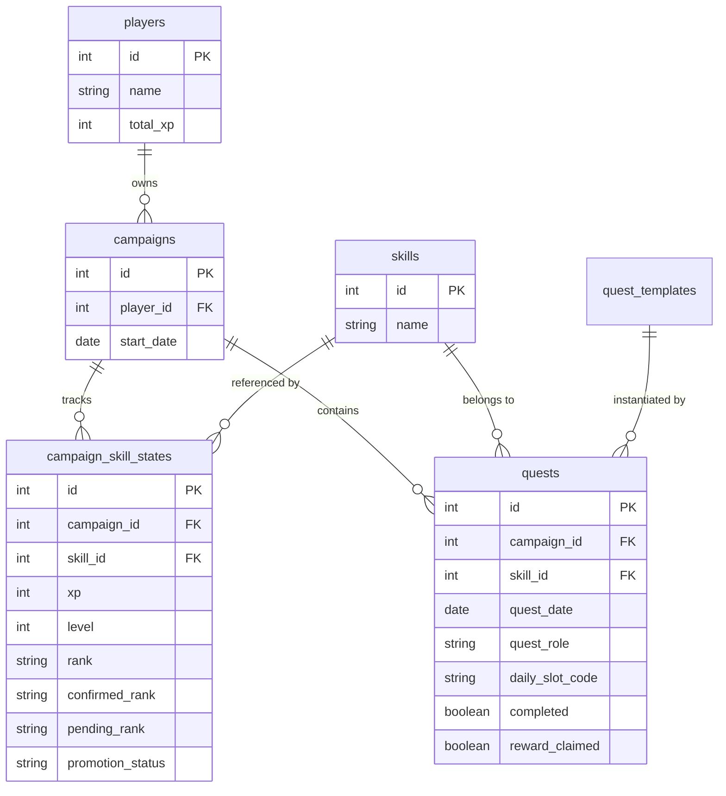

# Báo cáo Cấu trúc Lưu trữ Daily Quest & Tiến trình Kỹ năng

Tài liệu này tổng hợp chi tiết cách hệ thống lưu trữ các dữ liệu liên quan đến **Daily Quest** (Nhiệm vụ hàng ngày) và **Skill Progression** (Tiến trình kỹ năng) trong Cơ sở dữ liệu hiện tại (sau đợt di cư Wave E).

---

## 1. Lưu trữ Daily Quests (Nhiệm vụ hàng ngày)

Các nhiệm vụ hàng ngày được quản lý thông qua hai bảng chính trong cơ sở dữ liệu:

### A. Mẫu Nhiệm vụ (`quest_templates`)
* **Mục đích**: Lưu trữ các khuôn mẫu định sẵn để sinh ra Quest thực tế.
* **Các trường quan trọng**:
  * `id`: Khóa chính.
  * `title`: Tiêu đề nhiệm vụ.
  * `description`: Mô tả chi tiết.
  * `primary_skill_id`: Liên kết tới bảng kỹ năng (`skills.id`).
  * `base_xp`: Điểm kinh nghiệm nhận được mặc định.
  * `quest_role`: Vai trò nhiệm vụ (`core` - chính, `support` - bổ trợ, `mini` - phụ).

### B. Thực thể Nhiệm vụ (`quests`)
* **Mục đích**: Lưu trữ các Quest cụ thể được giao cho người học trong từng ngày.
* **Các trường quan trọng**:
  * `id`: Khóa chính.
  * `quest_date`: Ngày giao Quest.
  * `campaign_id`: Khóa ngoại liên kết tới chiến dịch hiện tại (`campaigns.id`).
  * `skill_id`: Khóa ngoại liên kết tới kỹ năng tương ứng (`skills.id`).
  * `quest_role`: Vai trò thực tế (`core`, `support`, `mini`).
  * `daily_slot_code`: Mã slot trong ngày. **(FINAL) Mở rộng từ 3 mã cũ (`core`/`support`/`mini`) lên 9 mã** để chứa 9 daily quest/ngày (cần migration). Dùng để thiết lập ràng buộc duy nhất.
  * `completed`: Trạng thái đã hoàn thành (`True`/`False`).
  * `reward_claimed`: Trạng thái đã nhận thưởng XP (`True`/`False`).

> **9 daily_slot_code (FINAL)** — khớp [`ielts_xp_policy_rank_quest_spec.md`](ielts_xp_policy_rank_quest_spec.md) §5:
> `vocab_flashcard`, `vocab_codex`, `vocab_collocation`, `listening`, `reading`, `writing`, `speaking`, `grammar_review`, `grammar_exercise`.
> XP routing: 3 vocab slot → Vocabulary; `grammar_review`/`grammar_exercise` → **Writing** (Grammar là nguồn phụ); `vocab_collocation` → Vocabulary (Collocation là nguồn phụ).

> **Ràng buộc duy nhất (Unique Invariant)**:
> Hệ thống áp dụng Unique Constraint `uq_quests_campaign_date_daily_slot` trên bộ ba cột:
> `(campaign_id, quest_date, daily_slot_code)`
> *Mục đích*: Ngăn chặn việc sinh trùng lặp daily quest cùng slot cho cùng một người dùng trên cùng một ngày trong chiến dịch. Với 9 mã slot, mỗi ngày cho phép tối đa 9 daily quest (mỗi slot 1). Main Quest giữ `daily_slot_code = Null` để bỏ qua ràng buộc này.

---

## 2. Lưu trữ Tiến trình Kỹ năng (Skill Progression)

Tiến trình kỹ năng được tách biệt giữa **Danh mục kỹ năng** (tĩnh) và **Tiến độ học tập** (động, theo từng chiến dịch):

### A. Danh mục Kỹ năng (`skills`)
* **Mục đích**: Lưu trữ tên và biểu tượng của kỹ năng học tập.
* **Các trường**: `id`, `name` (Listening, Reading, Writing, Speaking, Vocabulary...), `icon`.

### B. Tiến trình Kỹ năng (`campaign_skill_states`)
* **Mục đích**: Lưu trữ tiến trình động tương tự như bảng `user_skill_progress`.
* **Ràng buộc**: Khóa duy nhất trên bộ đôi `(campaign_id, skill_id)` để đảm bảo mỗi kỹ năng trong một chiến dịch chỉ có một bản ghi tiến trình duy nhất.
* **Chi tiết cấu trúc lưu trữ**:

| Yêu cầu thông tin | Cột tương ứng trong Database | Kiểu dữ liệu | Mô tả |
| :--- | :--- | :--- | :--- |
| **`skill_id`** | `skill_id` | `Integer (FK)` | Khóa ngoại liên kết trực tiếp tới `skills.id` |
| **`user_id`** | `player_id` | `Integer (FK)` | Được đại diện trực tiếp thông qua liên kết `campaign_id` -> `campaigns.player_id` (trỏ đến `players.id`). Riêng kho từ vựng Codex thì dùng trực tiếp cột `player_id` trọn đời. |
| **`skill_xp`** | `xp` | `Integer` | Điểm kinh nghiệm tích lũy của kỹ năng đó trong chiến dịch. |
| **`skill_level`** | `level` | `Integer` | Cấp độ kỹ năng **mịn (1–60)**. Tự động tăng theo XP trên đường cong `xp(L)=round(19*(L^1.6-1))`. Cứ 10 level = 1 rank (xem XP policy spec §2). |
| **Thứ hạng F -> S** | `rank` / `confirmed_rank` | `String(2)` | Thứ hạng kỹ năng: `F`, `E`, `D`, `C`, `B`, `A`, `S`. `rank` = tính từ XP; `confirmed_rank` = chính thức (boss/certificate). Writing/Speaking **không** boss-gated → `confirmed_rank = rank`. |
| **Trạng thái thăng hạng** | `pending_rank` / `promotion_status` | `String` | (đã có trong code, bổ sung vào ERD) Rank chờ xác nhận + trạng thái flow boss: `none`/`eligible`/`boss_required`/`in_progress`/`passed`. |

> **Lưu ý skill taxonomy (FINAL):** chỉ 5 skill matrix (Listening, Reading, Writing, Speaking, Vocabulary) có rank hiển thị và tính vào trung bình player. Collocation/Grammar là nguồn phụ (route XP vào Vocabulary/Writing tương ứng), không có rank độc lập trên UI. Player rank = `rank_from_level(level_from_xp(mean(5 skill xp)))` — player **không** tự cộng XP.

---

## 3. Sơ đồ Quan hệ thực thể (ERD) rút gọn

