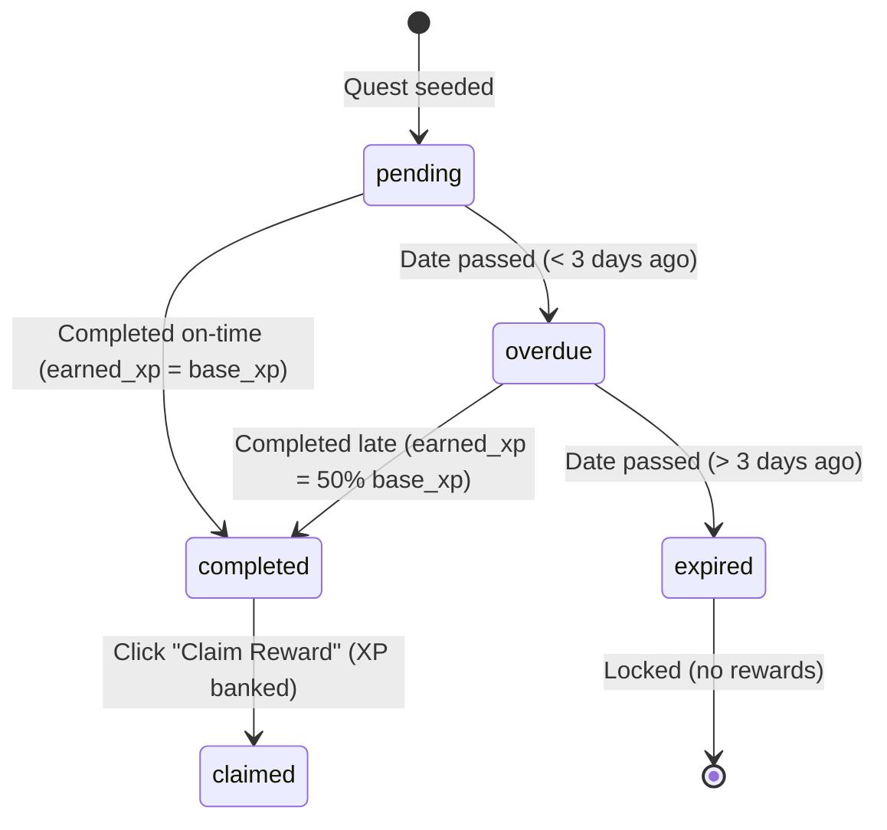
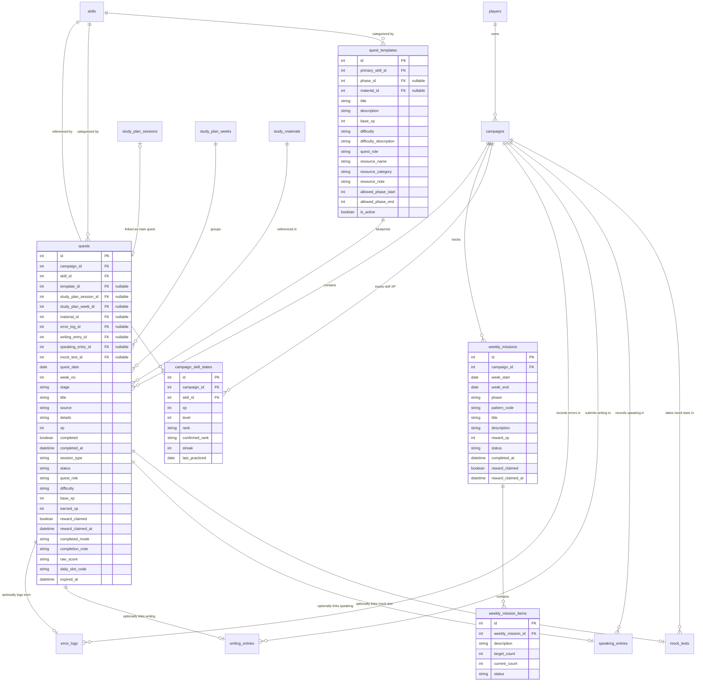

# Quest System & Completion Specification

This document details the mechanics, database structure, and business logic for managing **Quests** and tracking their completion status within the IELTS Quest Dashboard.

---

## 1. Overview of Quests

The Quest system drives daily study habits and guides the learner through the 18-month IELTS study roadmap. It consists of three primary quest types, supported by a historical log:

1. **Daily Quests**: Regular daily tasks generated from templates, encouraging consistent study and protecting the player's streak.
2. **Main Quests**: Structured study sessions linked directly to the 18-month syllabus and weekly study plans.
3. **Weekly Missions**: Higher-level weekly objectives that require accumulating study actions (e.g., completing daily quests, check-ins, or error entries).
4. **Quest Archive**: A query-based historical view of all completed, overdue, or expired quests across the campaign.

---

## 2. Quest Blueprints: Quest Templates (`quest_templates`)

Daily quests are instantiated dynamically using blueprints stored in the `quest_templates` table. This decouples template definitions from individual campaign instances.

### Schema: `quest_templates`

| Column | Type | Description |
| :--- | :--- | :--- |
| `id` | `Integer` (PK) | Unique template identifier. |
| `title` | `String(200)` | Name of the quest template. |
| `description` | `Text` | Detailed instructions for the task. |
| `primary_skill_id` | `Integer` (FK) | References `skills.id`. Categorizes the quest's main skill. |
| `phase_id` | `Integer` (FK, Nullable) | References `roadmap_phases.id`. Links template to a syllabus phase. |
| `material_id` | `Integer` (FK, Nullable) | References `study_materials.id`. Suggests study resources. |
| `base_xp` | `Integer` | Base XP awarded upon on-time completion (default: `10`). |
| `difficulty` | `String(20)` | Difficulty level (e.g., `"easy"`, `"normal"`, `"hard"`). |
| `difficulty_description` | `String(255)` | User-facing difficulty context. |
| `quest_role` | `String(20)` | Role in daily study: `"core"` (main), `"support"` (reinforcement), or `"mini"` (lightweight maintenance). |
| `resource_name` | `String(255)` | Resource textbook or practice source. |
| `resource_category` | `String(80)` | Resource type classification. |
| `resource_note` | `String(255)` | Practical notes on resource usage. |
| `allowed_phase_start` | `Integer` | Starting phase order where this template is active. |
| `allowed_phase_end` | `Integer` | Ending phase order where this template remains active. |
| `is_active` | `Boolean` | Flag indicating whether this template can be currently selected. |

---

## 3. Quest Instances (`quests`)

Quest instances are concrete tasks assigned to a player's campaign for a specific date. Both **Daily Quests** and **Main Quests** are stored in the `quests` table.

### A. Distinguishing Quest Types
* **Daily Quests**: Identified by `session_type = "Daily Quest"`. They have a defined `quest_role` (`"core"`, `"support"`, or `"mini"`) and map to `daily_slot_code` (`"core"`, `"support"`, or `"mini"`).
* **Main Quests**: Identified by `session_type = "Main Quest"`. They are linked to a specific roadmap session via `study_plan_session_id`.

### B. Schema: `quests`

| Column | Type | Description |
| :--- | :--- | :--- |
| `id` | `Integer` (PK) | Unique quest identifier. |
| `quest_date` | `Date` | Assigned date for the quest. |
| `week_no` | `Integer` | Week index of the campaign (1 to 78). |
| `stage` | `String(80)` | Roadmap stage name (e.g., `"Months 1-3"`). |
| `title` | `String(200)` | Name of the quest. |
| `skill_id` | `Integer` (FK) | References `skills.id`. |
| `source` | `String(255)` | Study resource/textbook reference. |
| `details` | `Text` | Description of study task. |
| `xp` | `Integer` | Base XP value (mirroring template `base_xp` or session XP). |
| `completed` | `Boolean` | `True` if task completed, else `False`. |
| `completed_at` | `DateTime` (Nullable) | Timestamp of quest completion. |
| `session_type` | `String(80)` | `"Daily Quest"` or `"Main Quest"`. |
| `campaign_id` | `Integer` (FK, Not Null) | References the owner campaign (`campaigns.id`). |
| `phase_id` | `Integer` (FK, Nullable) | References `roadmap_phases.id`. |
| `study_plan_week_id` | `Integer` (FK, Nullable) | References `study_plan_weeks.id` (mainly for Main Quests). |
| `study_plan_session_id` | `Integer` (FK, Nullable) | References `study_plan_sessions.id` (exclusively for Main Quests). |
| `template_id` | `Integer` (FK, Nullable) | References `quest_templates.id` (exclusively for Daily Quests). |
| `material_id` | `Integer` (FK, Nullable) | References `study_materials.id`. |
| `status` | `String(20)` | Lifecycle state: `"pending"`, `"completed"`, `"claimed"`, `"overdue"`, or `"expired"`. |
| `quest_role` | `String(20)` | `"core"`, `"support"`, `"mini"`, or `"main"`. |
| `difficulty` | `String(20)` | Quest difficulty. |
| `base_xp` | `Integer` | Base XP value before penalty calculations. |
| `earned_xp` | `Integer` | Actual XP awarded based on timing and status. |
| `reward_claimed` | `Boolean` | `True` if XP reward has been claimed and banked, else `False`. |
| `reward_claimed_at` | `DateTime` (Nullable) | Timestamp of when reward was claimed. |
| `completed_mode` | `String(20)` (Nullable) | `"on_time"` or `"overdue"`. |
| `completion_note` | `String(255)` | User notes added during completion. |
| `raw_score` | `String(120)` | Captured score or metrics (e.g., correct questions). |
| `daily_slot_code` | `String(20)` (Nullable) | Uniqueness slot: `"core"`, `"support"`, `"mini"`. Null for Main Quests. |
| `expired_at` | `DateTime` (Nullable) | Timestamp when quest transitioned to expired. |

### C. Nullable Typed Links (Evidence Trackers)
To associate quest completions with real study output and evidence logs, the schema includes typed nullable foreign key columns pointing to respective tracking tables:
* `error_log_id` (FK to `error_logs.id`): Linked when correcting mistakes.
* `writing_entry_id` (FK to `writing_entries.id`): Linked to draft essay entries.
* `speaking_entry_id` (FK to `speaking_entries.id`): Linked to speaking practice audios/transcripts.
* `mock_test_id` (FK to `mock_tests.id`): Linked to sectional or full mock tests.

*Note: Legacy fields `tracker_type` and `tracker_entry_id` are maintained for compatibility but the typed fields are preferred for new writes.*

### D. Uniqueness Invariants
To prevent duplicate daily quests, the table enforces a unique constraint:
`uq_quests_campaign_date_daily_slot` on `(campaign_id, quest_date, daily_slot_code)`

* **Rule**: A campaign cannot have more than one Daily Quest in a given role slot (`"core"`, `"support"`, or `"mini"`) for any single date. Main quests keep `daily_slot_code = Null` to bypass this constraint.

### E. Main Quest Seeding & XP Generation

> **Canonical XP values & routing: [`ielts_xp_policy_rank_quest_spec.md`](ielts_xp_policy_rank_quest_spec.md) §6.** The session-number tiering described in older revisions (S1=35, S2=40, S3=40…) is **STALE** — replaced by skill-based tiering + full-XP routing below.

Unlike Daily Quests which are dynamically selected from role templates, Main Quests are statically aligned with the player's 18-month roadmap.

1. **Seeding Mechanism**: During database initialization (`seed_database` in `seed.py`), the system parses `material.md` to construct `StudyPlanWeek` and `StudyPlanSession` records. For every single study session created:
   - A corresponding `Quest` instance is generated with `session_type = "Main Quest"`.
   - The instance is mapped to `study_plan_session_id` and `study_plan_week_id`.
   - `quest_role` is set to `"main"`.
   - `daily_slot_code` is left as `Null` to bypass the unique daily constraint (allowing Main Quests to co-exist alongside Daily Quests on the same day).
   - The quest date (`quest_date`) is set to the study date of the session (`StudyPlanSession.study_date`).

2. **XP Tier by Skill (FINAL)**: 312 Main Quests = 78 weeks × 4 fixed sessions. The XP tier is chosen from the session's **skill column** in `material.md`, not the session number:

   | Session | Skill column | Matrix skills credited | Tier | XP |
   |---|---|---|---|---:|
   | S1 | Listening + Speaking | Listening, Speaking | standard | 35 |
   | S2 | Reading + Vocabulary + Long sentence | Reading, Vocabulary | standard | 35 |
   | S3 | Writing + Grammar | Writing (Grammar→Writing) | heavy_output | 45 |
   | S4 | Review + Mini test + Error log | dominant weekly skill / mock | review 25 / mock 60 |

3. **Full-XP Routing (FINAL)**: a Main Quest awards its **full tier XP to EVERY matrix skill** the session covers (NOT split). Example: S2 at 35 XP credits Reading +35 **and** Vocabulary +35. The Grammar component of S3 routes into Writing. Main Quests award **no** Player XP — player rank rises only through the per-skill averages.

---

## 4. Quest Status Lifecycle & Sync Logic

### A. Lifecycle Transitions
Quests transition through the following states:

### B. Status Synchronization Logic (`sync_quest_statuses`)
On every progression refresh, the backend evaluates active quest status against the current date:
1. **If Completed**: Status shifts to `"completed"`.
2. **If Not Completed and Date in Future**: Status is `"pending"`, and `expired_at` is cleared.
3. **If Not Completed and Date in Past**:
   * Calculate elapsed days: `overdue_days = (today - quest_date).days`.
   * If `overdue_days <= 3`: Status shifts to `"overdue"`.
   * If `overdue_days > 3`: Status shifts to `"expired"`, and `expired_at` is set to the current timestamp.

### C. XP Penalty Rules for Late Completion
* **On-time Completion** (`quest_date == today`):
  * `completed_mode` is set to `"on_time"`.
  * `earned_xp` is awarded at 100% of base value: `earned_xp = base_xp`.
* **Overdue Completion** (`quest_date < today`):
  * `completed_mode` is set to `"overdue"`.
  * `earned_xp` suffers a **50% penalty** (rounded down, minimum of 1 XP): `earned_xp = max(1, int(base_xp * 0.5))`.
* **Expired Quests**: Locked out from completion; no XP can be earned.

### D. Quest Archive & Backlog Mechanics
The Quest Archive and Backlog are not represented by independent tables in the database. Instead, they are generated dynamically using database query filters:

1. **Quest Backlog (`GET /api/quests/backlog`)**:
   - Returns uncompleted Daily Quests whose dates are in the past and whose status is exactly `"overdue"` (`Quest.status == "overdue"`).
   - This endpoint allows the frontend to easily aggregate and list all backlog daily quests that are within their 3-day grace period, prompting the user to complete them before they transition to `"expired"`.

2. **Quest Archive (Query Filters)**:
   - The full campaign history (completed, claimed, overdue, and expired quests) is fetched using `GET /api/quests` by specifying query parameters like `start`, `end`, `phase_id`, or `status`.
   - To show a chronological timeline of the campaign, the query filters by `campaign_id` and orders results by `quest_date` and `id` in ascending order.
   - Overdue quests in the Archive remain actionable: a user can navigate back to their history page to complete overdue quests (earning 50% XP) or claim rewards for completed quests that were not previously claimed.

---

## 5. Weekly Missions

Weekly missions present players with broader, cumulative goals. The system uses a 1-to-N relationship between a parent mission and its item requirements:

### A. Parent Mission (`weekly_missions`)
Tracks the week window (`week_start` and `week_end`), phase, reward XP, and overall status. When all child items are completed, the parent mission automatically transitions `status` to `"completed"`.

### B. Mission Items (`weekly_mission_items`)
Stores the targeted criteria. The backend periodically recalculates `current_count` based on campaign activity:
* **"daily quest count"**: Counts all daily quests completed within the week window.
* **"reading core quest"**: Counts completed core quests where `skill.name = "Reading"`.
* **"writing/speaking core quest"**: Counts completed core quests for writing/speaking.
* **"check-in or mini-review days"**: Combines count of distinct dates containing a mood check-in or completed mini quest.
* **"error log/writing/speaking trackers"**: Sums logged errors and writing/speaking entries within the week.
* **"overdue quests under 2"**: Validates if the count of overdue/expired quests is less than 2.

Item status automatically switches to `"completed"` once `current_count >= target_count`.

---

## 6. Reward Claiming & Banking Loop

The IELTS Quest progression loop enforces an explicit reward-claiming workflow:

1. **Task Action**: The user completes a quest or weekly mission, changing its status to `"completed"`.
2. **XP Banking Restriction**:
   * **Completing is not banking**: XP is **not** immediately added to the campaign or player totals when a quest or mission changes to completed.
   * `reward_claimed` remains `False`.
3. **Explicit Claim**: The user must trigger the claim action (e.g., clicking the "Claim" button in the UI, routing to `/api/quests/{id}/claim` or `/api/weekly-missions/{id}/claim`).
4. **Integration**: Upon claiming:
   * `reward_claimed` becomes `True` and `reward_claimed_at` is set.
   * The backend triggers a progress recalculation. Claimed XP aggregates into the relevant **skill** state (`campaign_skill_states.xp`) per the routing rules in [`ielts_xp_policy_rank_quest_spec.md`](ielts_xp_policy_rank_quest_spec.md) §4 (Grammar→Writing, Collocation→Vocabulary).
   * **The player does NOT accrue XP.** `player_xp` is re-derived as the **average of the 5 matrix skills**, then mapped to player level/rank via the level curve (XP policy spec §2). Player rank is the only player value shown on the UI.

---

## 7. Entity Relationship Diagram (ERD)

The following diagram represents how quests, templates, weekly missions, and progress states interact with the campaign and evidence trackers:

